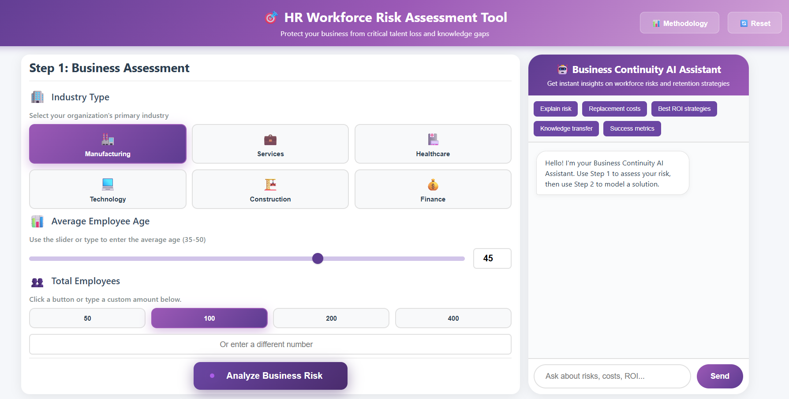
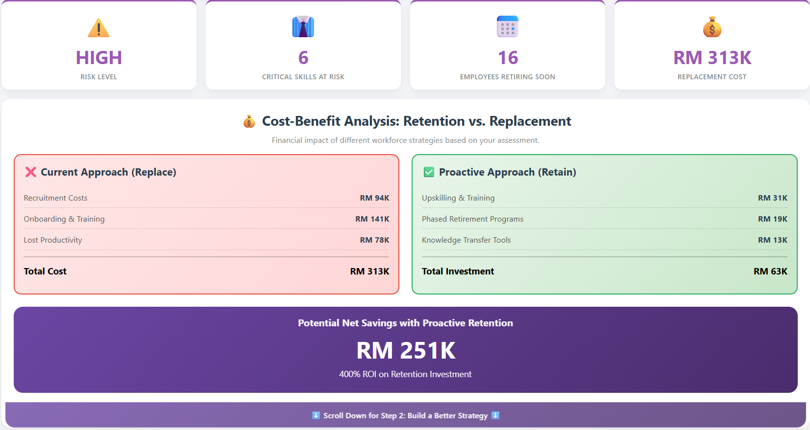
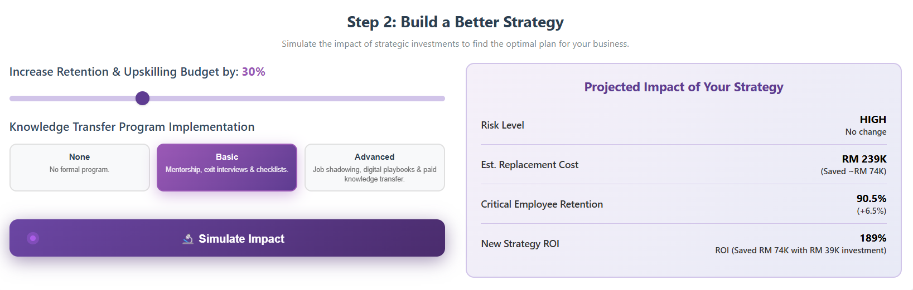
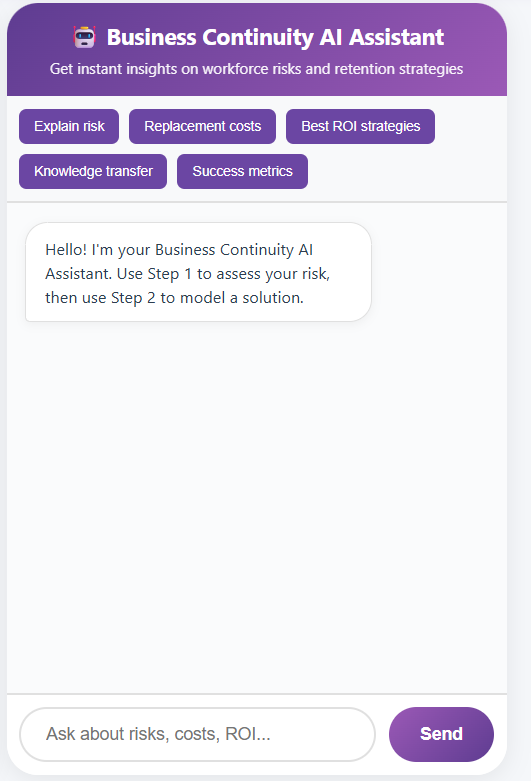

# HR-Workforce-Risk-Assessment-Tool
AI-powered HR tool to assess workforce risks, calculate replacement costs, and simulate retention strategies. Built with vanilla JavaScript, Google Gemini AI, and Netlify serverless functions.
# 🎯 HR Workforce Risk Assessment Tool


An intelligent web-based tool that helps HR professionals and business leaders assess workforce risks, calculate replacement costs, and simulate retention strategies with AI-powered insights.

## 📋 Table of Contents
- [Overview](#overview)
- [Features](#features)
- [Live Demo](#live-demo)
- [Screenshots](#screenshots)
- [Installation](#installation)
- [Deployment](#deployment)
- [How It Works](#how-it-works)
- [Technology Stack](#technology-stack)
- [API Configuration](#api-configuration)
- [Usage Guide](#usage-guide)
- [Project Structure](#project-structure)
- [Methodology](#methodology)
- [Contributing](#contributing)
- [License](#license)
- [Contact](#contact)

## 🌍 Overview

The HR Workforce Risk Assessment Tool addresses a critical business challenge: **protecting organizations from talent loss and knowledge gaps**. With an aging workforce, many companies face significant risks from retirement waves, but lack the tools to quantify and mitigate these risks proactively.

### The Problem
- **65% of critical knowledge** resides in employees nearing retirement
- Replacing a single senior employee costs **150-200% of their annual salary**
- Most organizations lack visibility into their workforce risk exposure
- Traditional succession planning is reactive, not proactive

### The Solution
A comprehensive, data-driven tool that:
1. **Assesses** your organization's baseline risk level
2. **Quantifies** the financial impact of employee turnover
3. **Simulates** different retention strategies
4. **Provides** AI-powered recommendations via an intelligent chatbot
5. **Generates** actionable reports for stakeholder presentations

## ✨ Features

### 📊 Step 1: Business Risk Assessment
- **Industry-Specific Analysis**: Customized risk profiles for 6 major industries
- **Workforce Demographics**: Factor in average employee age and company size
- **Risk Dashboard**: Visual metrics showing critical skills at risk, retiring employees, and replacement costs
- **Real-Time Calculations**: Instant analysis based on your inputs

### 💰 Cost-Benefit Analysis
- **Replacement vs. Retention**: Side-by-side comparison of reactive vs. proactive strategies
- **ROI Calculation**: Clear financial impact of retention investments
- **Detailed Cost Breakdown**: Recruitment, training, and productivity loss itemization
- **Savings Projection**: Potential net savings with proactive retention

### 🔬 Step 2: Strategy Simulator
- **Investment Slider**: Test budget increases from 0-100%
- **Knowledge Transfer Programs**: Compare None, Basic, and Advanced options
- **Live Projections**: See real-time impact on risk, costs, and retention rates
- **ROI Modeling**: Calculate returns on your simulated strategy

### 🤖 AI Business Continuity Assistant
- **Context-Aware Chat**: Powered by Google Gemini AI
- **Quick Actions**: Pre-built questions for common scenarios
- **Personalized Insights**: Recommendations based on your specific assessment
- **24/7 Availability**: Get instant answers to workforce risk questions

### 💼 Action Center
Three productivity-focused modules:
1. **Daily Dashboard**: Morning briefing on urgent alerts and action items
2. **Quick Actions**: One-click tasks for common retention activities
3. **Email Integration**: Automated alerts and calendar integration

### 📄 Comprehensive Reporting
- **Full Risk Reports**: Downloadable text reports with all metrics
- **Copy-to-Clipboard**: Easy sharing with stakeholders
- **Methodology Documentation**: Transparent calculation methods
- **Executive Summaries**: Key findings and recommendations

## 🎬 Live Demo

**[View Live Demo](#)** *(https://curious-tiramisu-10d542.netlify.app/)*

Try the tool with sample data:
- Industry: Technology
- Average Age: 45 years
- Employees: 200
- Expected Result: HIGH risk level with $3M+ replacement cost

## 📸 Screenshots

### Risk Assessment Dashboard

*Real-time risk metrics and critical employee analysis*

### Cost-Benefit Analysis

*Financial comparison of replacement vs. retention strategies*

### Strategy Simulator

*Interactive modeling of retention investments*

### AI Chat Assistant

*Context-aware recommendations and insights*

## 🚀 Installation

### Prerequisites
- Modern web browser (Chrome, Firefox, Safari, Edge)
- Text editor (VS Code, Sublime Text, etc.)
- Node.js 14+ (for local development with Netlify CLI)
- Google Gemini API Key

### Local Setup

1. **Clone the repository**
```bash
git clone https://github.com/yourusername/hr-workforce-risk-tool.git
cd hr-workforce-risk-tool
```

2. **Set up environment variables**
Create a `.env` file in the `netlify/functions` directory:
```
GEMINI_API_KEY=your_gemini_api_key_here
```

3. **Open locally**
Simply open `index.html` in your browser, or use a local server:
```bash
# Using Python
python -m http.server 8000

# Using Node.js http-server
npx http-server
```

4. **Test the chat function locally (optional)**
```bash
npm install netlify-cli -g
netlify dev
```

## 🌐 Deployment

### Deploy to Netlify (Recommended)

1. **Fork/Clone this repository to your GitHub account**

2. **Sign up for Netlify** at [netlify.com](https://netlify.com)

3. **Create New Site from Git**
   - Click "New site from Git"
   - Choose GitHub and select this repository
   - Build settings should auto-detect (already configured in `netlify.toml`)

4. **Add Environment Variable**
   - Go to Site Settings → Environment Variables
   - Add: `GEMINI_API_KEY` = your API key

5. **Deploy!**
   - Netlify will automatically deploy your site
   - You'll get a URL like: `https://your-site-name.netlify.app`

### Alternative: Deploy to Other Platforms

**Vercel:**
```bash
vercel --prod
```

**GitHub Pages:**
- Note: GitHub Pages doesn't support serverless functions
- You'll need to modify the chat feature or use a separate API endpoint

## 🛠 How It Works

### Risk Calculation Model

1. **Risk Score** = (Industry × 0.5) + (Age × 0.3) + (Size × 0.2)
   - Industry multipliers: Manufacturing (4), Healthcare (4), Tech (5), etc.
   - Age multipliers: 35-36 (1) to 47-50 (5)
   - Size multipliers: 50 employees (1) to 1000+ (5)

2. **Employees Retiring Soon** = Total × (Avg Age / 100) × 0.5
   - Assumes linear correlation over 5-year window

3. **Critical Skills at Risk** = Retiring × (Industry Multiplier × 0.1)
   - Higher for specialized industries

4. **Replacement Cost** = Retiring × RM 15,000 per employee
   - Based on SHRM research: 50-200% of salary

5. **Retention Investment** = Replacement Cost × 0.20
   - Research shows 15-25% effectiveness

### Strategy Simulation

**Investment Impact:**
- Risk Reduction: Base × (1 - Investment% × 0.25) × KT Multiplier
- Cost Reduction: Base × (1 - Investment% × 0.5) × KT Multiplier
- Retention Boost: Base + (Investment% × 15%)

**Knowledge Transfer Programs:**
- None: 1.0 multiplier, RM 0, +0% retention
- Basic: 0.9 multiplier, RM 20K, +2% retention
- Advanced: 0.75 multiplier, RM 50K, +5% retention

## 💻 Technology Stack

### Frontend
- **HTML5**: Semantic structure
- **CSS3**: Custom animations and gradients
- **Vanilla JavaScript**: No framework dependencies
- **Responsive Design**: Mobile-first approach

### Backend
- **Netlify Functions**: Serverless API endpoints
- **Google Gemini AI**: Conversational AI assistant
- **Node.js**: Runtime for serverless functions

### Deployment
- **Netlify**: Hosting and serverless functions
- **Git**: Version control
- **Environment Variables**: Secure API key management

## 🔑 API Configuration

### Getting a Google Gemini API Key

1. Go to [Google AI Studio](https://makersuite.google.com/app/apikey)
2. Sign in with your Google account
3. Click "Get API Key"
4. Copy your API key
5. Add to Netlify environment variables or `.env` file

### API Endpoint Structure

The chat function is located at `netlify/functions/chat.js`:

```javascript
POST /.netlify/functions/chat
Content-Type: application/json

{
  "message": "User question",
  "context": {
    "inputs": { ... },
    "results": { ... }
  }
}
```

## 📖 Usage Guide

### For HR Professionals

1. **Morning Routine** (5 minutes)
   - Open Daily Dashboard
   - Review overnight alerts
   - Approve pending actions

2. **Monthly Planning** (30 minutes)
   - Run full risk assessment
   - Simulate 3-4 retention strategies
   - Download report for leadership

3. **Quarterly Reviews** (1 hour)
   - Compare actual vs. projected retention
   - Adjust investment levels
   - Update succession plans

### For Business Leaders

1. **Quick Assessment** (10 minutes)
   - Enter basic org data
   - Review risk dashboard
   - Share with HR team

2. **Budget Planning** (20 minutes)
   - Test different investment scenarios
   - Compare ROI projections
   - Make data-driven decisions

3. **Board Presentations**
   - Generate full report
   - Use visuals from dashboard
   - Present cost-benefit analysis

## 📁 Project Structure

```
hr-workforce-risk-tool/
│
├── index.html                      # Main application file
├── netlify.toml                    # Netlify configuration
├── README.md                       # This file
├── LICENSE                         # MIT License
│
├── netlify/
│   └── functions/
│       └── chat.js                 # AI chat serverless function
│
├── screenshots/                    # Demo images
│   ├── dashboard.png
│   ├── roi-analysis.png
│   ├── simulator.png
│   └── ai-chat.png
│
└── docs/
    ├── METHODOLOGY.md              # Detailed calculation methods
    ├── API_DOCUMENTATION.md        # API usage guide
    └── DEPLOYMENT_GUIDE.md         # Detailed deployment steps
```

## 📊 Methodology

### Data Sources

**Industry Benchmarks:**
- Society for Human Resource Management (SHRM)
- Harvard Business Review workforce studies
- Bureau of Labor Statistics retirement data

**Cost Calculations:**
- Average replacement costs: 50-200% of annual salary
- Training productivity loss: 6-12 months
- Recruitment expenses: 15-30% of salary

**Retention ROI:**
- Knowledge transfer program effectiveness: 70-90%
- Phased retirement success rates: 80-85%
- Upskilling retention improvement: 25-40%

### Limitations

⚠️ **Important Disclaimers:**
- Estimates are for strategic planning, not precise predictions
- Actual costs vary by geography, industry, and role
- ROI depends on program implementation quality
- Results should be validated with HR data

See [METHODOLOGY.md](docs/METHODOLOGY.md) for complete technical details.

## 🤝 Contributing

Contributions are welcome! Here's how you can help:

**What this means:**
- ✅ Commercial use allowed
- ✅ Modification allowed
- ✅ Distribution allowed
- ✅ Private use allowed
- ⚠️ Liability and warranty not provided

## 👤 Contact

**Project Maintainer**  
Your Name

- GitHub: [THAM REN SHENG](https://github.com/RS-cloud14)
- LinkedIn: [Ren Sheng Tham](www.linkedin.com/in/ren-sheng-tham-245649258)
- Email: renshengtham@gmail.com

**Project Link**: [https://github.com/RS-cloud14/HR-Workforce-Risk-Assessment-Tool](https://github.com/RS-cloud14/HR-Workforce-Risk-Assessment-Tool/)

## 🙏 Acknowledgments

- **Google Gemini AI** - Conversational AI capabilities
- **Netlify** - Hosting and serverless functions
- **SHRM** - Workforce research and benchmarks
- **Open Source Community** - Inspiration and tools

## 🌟 Star History

If you find this tool helpful, please consider giving it a star! ⭐

---

<div align="center">

**Built with 💜 to help organizations protect their most valuable asset: their people**

[⬆ Back to Top](#-hr-workforce-risk-assessment-tool)

</div>
